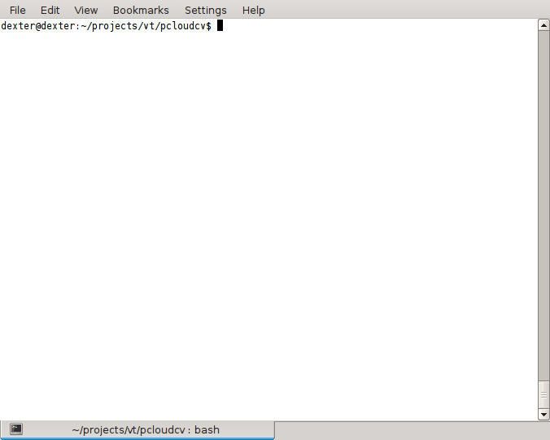

.. pcloudcv documentation master file, created by
   sphinx-quickstart on Fri Mar 13 15:31:29 2015.
   You can adapt this file completely to your liking, but it should at least
   contain the root `toctree` directive.

Welcome to PCloudCV's documentation!
====================================
**PCloudCV** are the python APIs for CloudCV: Large Scale Distributed Computer Vision as a Cloud Service. Using this package will require a ``config file`` that is located at ``pcloudcv/config.example.json``. Rename it to ``config.json`` after editing with appropriate configuration.

**Please note that the API's are going through major overhaul. You can follow the progress by cloning the development branch.**

Getting started with PCloudCV:

.. toctree::
   :maxdepth: 1

   installation
   Quick-start
   contents

PCloudCV in Action:

Indices and tables
==================

* :ref:`genindex`
* :ref:`modindex`
* :ref:`search`

